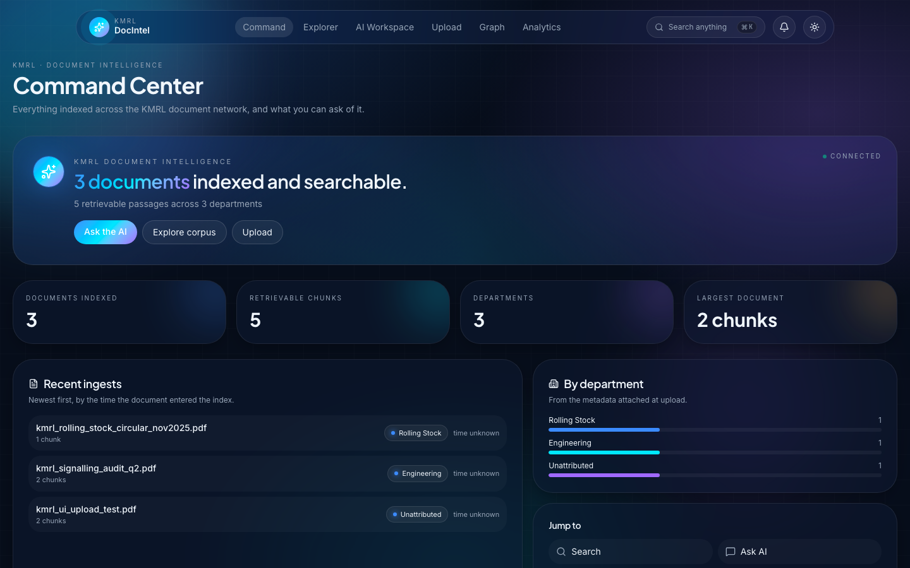

# 🚇 KMRL Document Intelligence

A document intelligence system for Kochi Metro Rail Limited that turns a pile of operational
documents into something you can ask questions of — upload a PDF, and within seconds it is
searchable by meaning and the AI can answer questions about it while citing the exact passages
it used.

## Features

- Upload PDF, DOCX, XLSX and image documents — parsed, cleaned, chunked, embedded and indexed in one pass
- Semantic search that matches meaning rather than keywords, with real similarity scores
- RAG chat that answers only from your documents and cites the passages behind every answer
- Multi-turn conversations with history, so follow-up questions resolve against what was already asked
- Scope any conversation to specific documents, so answers cannot drift outside them
- Document explorer with grid, list and timeline views over everything indexed
- Analytics built from actual corpus composition — documents per department, chunks per document
- Boots without the ML stack installed: heavy dependencies load lazily and unavailable backends return a clean 503
- Provider-agnostic generation — local Ollama by default, or any OpenAI-compatible endpoint without code changes
- No invented data: every number on screen traces to something the backend measured, and anything unmeasurable is shown as absent rather than guessed

## Tech Stack

**Frontend**
- TanStack Start (React 19, SSR)
- TypeScript
- Tailwind CSS v4
- TanStack React Query
- Recharts + Motion

**Backend**
- Python 3.13
- FastAPI
- Pydantic v2 / pydantic-settings

**Vector store**
- Qdrant

**Embeddings**
- sentence-transformers (`all-MiniLM-L6-v2`, 384-dim, cosine)

**AI**
- Ollama (`llama3.2:3b`) for local generation
- Any OpenAI-compatible endpoint (OpenAI, Groq, Azure, vLLM) via configuration

**Ingestion**
- PyMuPDF, python-docx, openpyxl, Pillow
- tiktoken for token-aware chunking

**Infrastructure**
- Docker + Docker Compose
- Vercel (frontend), any container host (API)

## Project Structure

```
config/              Pydantic settings, logging, prompt templates
src/
  api/               FastAPI app, routes, schemas, middleware, DI
  ingestion/         File loaders and parsers, validation
  preprocessing/     Cleaner, normalizer, token-aware chunker
  embeddings/        SentenceTransformers manager + schemas
  vector_store/      Abstract store + Qdrant provider
  retrieval/         BM25, hybrid (RRF), semantic search, reranker
  generation/        LLM manager wrapping the OpenAI-compatible client
  llm/               LLM client, prompts, guardrails, response parsing
  agents/            Per-concern agents + ingestion workflow
  analysis/          Classifier, summarizer, risk, metadata, recommendations
  knowledge_graph/   Entity extraction, graph queries, visualizer
  pipeline/          Upload / search / chat / indexing pipelines
  evaluation/        RAGAS, retrieval and classification metrics
frontend/src/
  lib/api/           Typed client, React Query hooks, schema mirrors
  routes/            Command centre, search, workspace, upload, explorer, graph
  components/        Shared UI primitives and the command palette
Dockerfile
DEPLOYMENT.md
```

## Installation

Clone the repository:

```bash
git clone https://github.com/POOJIKASRI-V-29/Metro_Intel_Hub.git
cd Metro_Intel_Hub
```

Start the vector store and an LLM:

```bash
docker run -d -p 6333:6333 -v "$PWD/data/qdrant:/qdrant/storage" qdrant/qdrant
ollama serve &
ollama pull llama3.2:3b
```

Run the backend:

```bash
python3 -m venv .venv
source .venv/bin/activate
pip install -r requirements.txt
cp .env.example .env
uvicorn src.api.main:app --reload --port 8000
```

Run the frontend:

```bash
cd frontend
npm install
cp .env.example .env
npm run dev
```

- Frontend: http://localhost:8080
- Backend API: http://localhost:8000 (docs at `/docs`)
- Qdrant: http://localhost:6333

Index the sample document and ask about it:

```bash
curl -F "file=@samples/kmrl_signalling_audit_q2.pdf" localhost:8000/v1/documents/upload

curl -X POST localhost:8000/v1/chat -H 'Content-Type: application/json' \
  -d '{"session_id":"s1","message":"What is blocking the firmware fix?","chat_history":[]}'
```

## How Retrieval-Augmented Chat Works

```
your question
   ↓  embed          the query becomes a 384-dim vector
   ↓  retrieve       cosine search in Qdrant, optionally scoped to documents
   ↓  ground         top passages assembled into a bounded context block
   ↓  generate       the LLM answers using only that context
   ↓  cite           every answer carries the passages it was built from
answer + citations + token usage
```

The model never reaches the database. Retrieval happens first, the application decides what
context the model may see, and what comes back is checked against a response schema before it
reaches the UI. If retrieval finds nothing, the answer says so instead of inventing one.

## Deployment

See **[DEPLOYMENT.md](DEPLOYMENT.md)**.

The frontend deploys to Vercel — the nitro preset is pinned, so `npm run build` emits a
`.vercel/output` bundle Vercel serves directly. The backend needs a container host rather than
serverless: it loads torch and an embedding model, which puts it past serverless size limits.
The root `Dockerfile` builds it CPU-only.

There is no public instance running yet. Deploying needs a Qdrant Cloud cluster, a hosted LLM
endpoint and a container host — all covered in the deployment guide.

## API Surface

| Area | Route |
| --- | --- |
| Health | `GET /health` |
| Upload / ingest | `POST /v1/documents/upload` |
| List indexed documents | `GET /v1/documents` |
| Search | `POST /v1/search` |
| Chat (RAG) | `POST /v1/chat` |
| Analytics | `/analytics/*` |
| Knowledge graph | `/graph/*` |
| Classify · Metadata · Recommend · Summarize | `/classify/*` · `/metadata/*` · `/recommend/*` · `/summarize/*` |

There is no document table. `GET /v1/documents` folds the chunk payloads in Qdrant back into
document-level summaries, so a document is listed exactly when it is retrievable.

## Screenshots

The command centre, reading a live index — every figure on it is measured, not seeded.



## Notes

- The ingestion, search and chat path is verified end to end against real services. The analysis and graph endpoints — `/analytics/dashboard`, `/summarize/text`, `/classify/text`, `/metadata/{id}`, `/recommend/{id}` and `/graph/*` — still return placeholder data marked `TODO` in their route modules, and are not yet wired to the services in `src/analysis/` that would implement them.
- The frontend renders whatever the API actually returns, so a placeholder response surfaces as a placeholder rather than as a figure dressed up as real.
- `/v1/search` accepts `search_type` and `use_reranker`, but both are currently ignored: every search runs semantic. `src/retrieval/{bm25_search,hybrid_search,reranker}.py` implement those pieces and nothing imports them yet.
- OCR extras (`paddleocr`, `pytesseract`) are optional and excluded from the container image. Image ingestion needs them plus the native engines; PDF, DOCX and XLSX ingestion do not.
- `chromadb` is commented out in `requirements.txt` — `ChromaVectorStore` is reachable only from `src/retrieval/semantic_search.py`, which has no importers.
- The `Dockerfile` is written for CPU-only hosts but has not yet been built to completion, so treat the first deploy as the real test.

## Author

Poojikasri V
